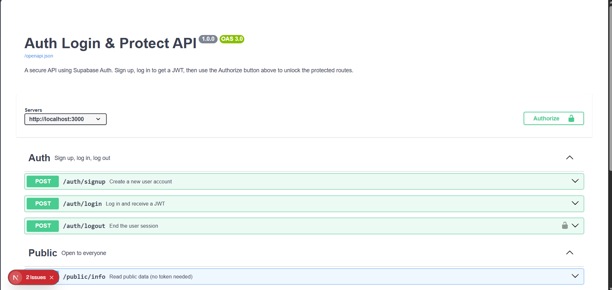

# Auth Login & Protect

A secure API built with Next.js and Supabase Auth. Users can sign up, log in and
log out; some routes are protected by a JWT and some are public.

## Setup

1. Install dependencies:

   ```bash
   npm install
   ```

2. Copy `.env.example` to `.env` and fill in your Supabase Project URL and Anon Key
   (Supabase Dashboard -> Project Settings -> API).

3. Start the server:

   ```bash
   npm run dev
   ```

   It runs on http://localhost:3000 and logs
   `Server running and connected to Supabase`.

## Routes

| Method | Route                  | Purpose                     | Auth |
| ------ | ---------------------- | --------------------------- | ---- |
| POST   | `/auth/signup`         | Create a new user account   | No   |
| POST   | `/auth/login`          | Log in and receive a JWT    | No   |
| POST   | `/auth/logout`         | End the user session        | Yes  |
| GET    | `/public/info`         | Read public data            | No   |
| GET    | `/protected/profile`   | Read private profile data   | Yes  |
| GET    | `/protected/dashboard` | Read private dashboard data | Yes  |

Protected routes expect the token in the header:

```
Authorization: Bearer <access_token>
```

## API Docs (Swagger UI)

With the server running, open http://localhost:3000/docs

The protected routes show a padlock icon. To test them:

1. Run `POST /auth/signup`, then `POST /auth/login`.
2. Copy the `access_token` from the login response.
3. Click the green **Authorize** button at the top, paste the token, click
   **Authorize**, then **Close**.
4. Open `GET /protected/profile` -> **Try it out** -> **Execute**. You get `200`
   and your user details.



## How the auth flow works

1. The client sends email + password to `/auth/signup` or `/auth/login`.
2. Our server passes those to Supabase, which checks them and returns a JWT.
3. The client sends that JWT back on every protected request.
4. `lib/auth.js` (`requireAuth`) verifies the JWT with Supabase before the route
   runs. Invalid or expired tokens never reach the route logic.

## Project structure

```
app/
  auth/signup/route.js      POST /auth/signup
  auth/login/route.js       POST /auth/login
  auth/logout/route.js      POST /auth/logout
  public/info/route.js      GET  /public/info
  protected/profile/route.js    GET /protected/profile
  protected/dashboard/route.js  GET /protected/dashboard
  docs/page.js              Swagger UI at /docs
lib/
  supabase.js               Shared Supabase client
  auth.js                   requireAuth guard used by protected routes
public/
  openapi.json              API description that Swagger UI reads
```

## Note on logout

`POST /auth/logout` revokes the session's refresh token, so the session cannot be
renewed. The access token itself stays valid until it expires (about 1 hour),
which is normal JWT behaviour.
